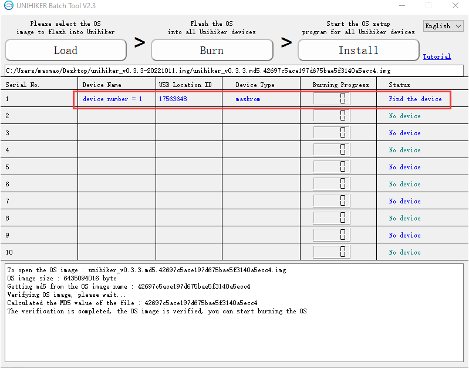
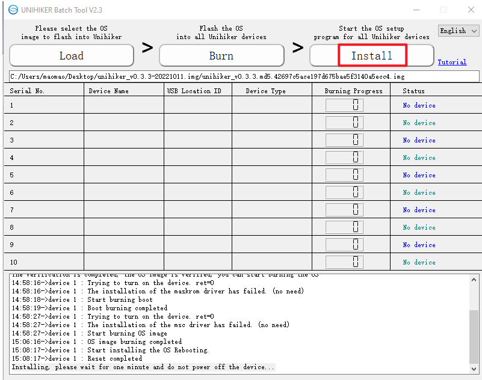
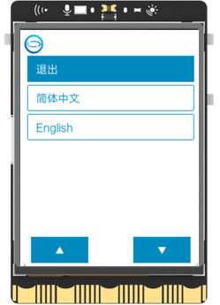

If you need to update your UNIHIKER system to the latest version or restore a malfunctioning system, you can follow these steps to flash a new OS. Please note that the UNIHIKER comes with a Linux operating system based on Debian and various built-in features, which may be updated periodically.
## **1- File Backup**

- Before re-flashing the OS image, please note that all files on the UNIHIKER, including those in the root directory, will be cleared and cannot be restored. We recommend backing up any necessary files before proceeding with the firmware flashing process.
- To save personal files from the root directory before flashing the OS, you can use the SMB function to copy them to your computer. After the OS is refreshed, you can copy the files back to the UNIHIKER. Please note that hidden files will not be copied.
## **2- Tool Preparation**
### **1. Burning tool**
You need to use the Command-line Tool to burn the system image. If you are using Windows, you can also choose a batch burning tool with a GUI interface.
### **1.1 Command-line Tool**
To use the command-line tool for updating the UNIHIKER system image, follow these instructions: [Click to view.](https://www.unihiker.com/wiki/burner_command_line)
### **1.2 Batch Tool**
Note: The burning tool for updating system images on the UNIHIKER has been upgraded to a batch burning tool, allowing you to burn images to up to 10 boards simultaneously. Please note that currently, only the Windows version is available. For Linux or Mac platforms, please use the command-line tool.
**Windows version (no installation required, just extract and run):**

| **Download channel** | **Windows** | **Mac** | **Linux** |
| --- | --- | --- | --- |
| **Download:** | [Click to download](https://download3.dfrobot.com.cn/unihiker/Burner/UNIHIKER_Batch_Tool_V2.3_2023.4_en.zip) | Using the [Command-line Tool](https://www.unihiker.com/wiki/burner_command_line) | Using the[Command-line Tool](https://www.unihiker.com/wiki/burner_command_line) |
| **Download from Google Drive:** | [Click to download](https://drive.google.com/drive/folders/1JU73SOyN5VmpB6ilbxVNvCB9qXfc-Qo-?usp=sharing) | / | / |

### **2.OS Image**
To begin, download the OS img image file that needs to be flashed. Once downloaded and extracted, you will have an img format image file.
**Download V0.3.6 System Image**
**Name:** unihiker_v0.3.6.md5.0234c1218cc19119c6ca78ec8fe01048.img

| **Download channel** | 
 |
| --- | --- |
| **Download:** | [Click to download](https://download3.dfrobot.com.cn/unihiker/img/https://download3.dfrobot.com.cn/unihiker/img/unihiker_v0.3.6_20240704_2351.7z) |
| **Download from Google Drive:** | [Click to download](https://drive.google.com/drive/folders/1JU73SOyN5VmpB6ilbxVNvCB9qXfc-Qo-?usp=sharing) |

**OS V0.3.6 Release Logs:**

- The Local Web Page has been optimized to improve the WiFi connection process and reduce errors.
- The WiFi list on the Local Web Page can now be filtered to remove the self hotspot, improving the user experience.
- Modify some texts in Home Menu.
- The link for the "View Tutorial" page in the Home menu has been changed for better accessibility.
- The issue of non-existent files in the auto-startup process has been resolved.
- Increase CPU frequency setting.
- The tun driver has been updated with the latest version.
- Zip and 7z have been added to the built-in package for easier file compression and extraction.
- Update siot, pinpong, df-xfyun-speech libraries to the latest version.

**OS V0.3.5 ReleaseLogs:**

- Added language switching function in Home menu, supports Chinese and English.
- The demo folder is added in the switching running program, which contains 7 demo programs.
- Add the mindplus folder in the switching program, so that it is convenient to quickly run the program transferred from Mind+.
- Added automatic reconnection after USB disconnection, improving the stability of USB connection.
- Increase the function of recording hotspot switch status.
- Increase the screen brightness adjustment command (brightness).
- The calibration page adds Chinese and English bilingual prompts.
- fix apt upgrade error.
- Update three built-in dedicated libraries (siot, pinpong, unihiker) to the latest version.
- Add a batch of built-in libraries:
   - webssh
   - opencv_contrib_python
-pyzbar
   - dominate
-pypinyin
   - lsusb
-onnxruntime
-graphviz
## **3- Operation Steps**
### **3.1- Load OS file**

- To use the UNIHIKER Batch Tool, open the UNIHIKERBatchTool.exe file and click on the Load button. Select the system image (img) file and the file path will be displayed below.

!!! note
    The V2.3 image burning tool now includes a file verification function. After loading the system file, the md5 verification will be performed on the file, which may take between 30 seconds to 5 minutes depending on the computer's performance. If the md5 value after the file name is inconsistent, it will prompt that the image is damaged.  

### **3.2- Enter firmware flashing mode**

- Before using the batch tool, please disconnect the UNIHIKER from the power source and remove the memory card.
- To enter firmware flashing mode, hold down the Home button on the board and connect it to your computer via USB cable. The board will display a white screen and should be recognized as a new device by the software.
- Once the software has recognized the board as a new device, you can release the Home button. If you need to flash multiple boards at the same time, simply repeat the steps above for each board.

### **3.3- Start burning**

- Once the board to be flashed is recognized, click on "Burn" to begin the firmware flashing process. If this is the first time connecting the board, the driver will be installed before flashing can begin.

!!! note
    While the firmware is being flashed, check the output information in the lower window. If it seems to be stuck at a certain step for more than 5 minutes, please refer to the troubleshooting section at the end of the page for possible solutions.

### **3.4- Burning Completed**

- If you are flashing multiple boards, you will need to wait for each one to reach 100% or prompt an error before proceeding. Once the progress reaches 100%, the firmware flashing process is complete.

### **3.5- Install System**

- Once the firmware has finished flashing, click on "Install" to begin the installation process. The software will control all UNIHIKERs to restart and complete the installation of the new system.
- The new system will be automatically installed on the UNIHIKER, and it may restart multiple times during the process, which usually takes about one minute. Once the installation is complete, the board will stay on the language selection screen.
- During the installation process, please do not operate or power off the board. If a mistake is made, please re-flash the system.

### **3.6- Initial Setup**

- 1.On the language selection screen, you can use the AB buttons to move the cursor up and down, and the Home button to confirm your selection. After making your selection, the UNIHIKER will reboot.

If you accidentally select the wrong language, you can reselect your desired language from the [Home Menu](https://www.unihiker.com/wiki/homemenu).  

- 2.After selecting your language, the UNIHIKER logo will appear. Press the HOME button to enter the HOME menu. Use the A and B buttons to move the cursor up and down, and use the HOME button to confirm. Select "Enter" to check the system information and make sure that the system version matches the version of the system image that was just installed. If it does, then the system image has been successfully burned.

- 3.After flashing the system, the touch screen will need to be re-calibrated before use. To do this, select "Calibrate touch screen" in the HOME menu. The screen will display five touch points in sequence. Click on each touch point, and the system will restart to complete the calibration process.

| **Q** | **If the device to be burned is not displayed, what should I do?** |
| --- | --- |
| A | First, make sure your computer can access the UNIHIKER board correctly. When the board is powered on normally and displays the logo on the screen, you should be able to access the board's webpage menu by entering 10.1.2.3 in your web browser.
Then, make sure to follow the steps for burning the system image carefully. It's important to turn off the board and disconnect it from power first, then press and hold the Home button before connecting the USB cable to the PC to let the board enter system image burning mode. |

| **Q** | **The system burning is complete and the progress reaches 100%, but the UNIHIKER still cannot boot up after one minute.** |
| --- | --- |
| A | Maybe the system file is not fully downloaded. You can try to downloading the file from a different source. |

| **Q** | **What should I do if I get stuck at the "Starting" or "Installing Driver" step for more than 5 minutes?** |
| --- | --- |
| A | Restart the burning tool and try burning again. If it still exists, power off the board and re-enter the burning mode, then restart the burning tool to burn. or try using the Command-line Tool |

| **Q** | **How can I create a full image backup for the UNIHIKER?** |
| --- | --- |
| A | [click](https://www.dfrobot.com/forum/topic/327538) |

If you encounter any issues that cannot be resolved during use, please don't hesitate to contact us through either of the methods listed below:

1. Join our UNIHIKER channel by the link https://discord.gg/rvvfNCvBKv.
2. Send emails to our mailbox: unihiker@dfrobot.com  

---  

